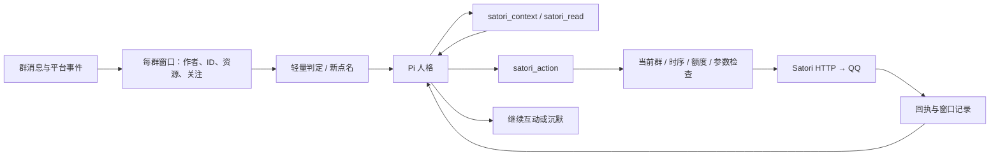

# 群聊模拟对话审计与改造（2026-09-08）

结论：存在明显增强空间，主要瓶颈在 ayjx 的群聊接入层。现有 satori-qq 已支持所需的
普通成员互动，不需要为了本次改造重新安装 QQ 模块。原有 Pi 群聊虽然有搜索工具，
平台输出却仍主要依赖“逐行文字 + 少量标记”，无法根据动作结果继续调整。

## 审计发现与实现

| 原有限制 | 本次处理 |
| --- | --- |
| 只有少量输出标记，点赞/撤回/文件/转发未接入人格 | 新增类型化 satori_action，直接落到现有 Satori API |
| 引用只能指向最后一条消息，模型看不到消息 ID | transcript 和 context 提供精确 ID，工具支持 reply_to |
| 图片、商城表情、引用参数在上下文中被压成占位符 | 保存原始 Message 元素，支持按 message_id 复用表情包/图片 |
| 戳一戳、撤回和表态被 as_message 过滤掉 | 新增事件观察；撤回清正文/媒体，表态不虚构操作者 |
| 最终输出之后才发送，模型看不到回执 | 本轮 Unix RPC 把真实成功/失败结果送回 Pi，可继续决策 |
| Pi 静默后可能整轮重试，外部动作会重复 | 有平台工具的调用关闭整轮静默重试，请求 ID 缓存回执 |
| 本机 Pi 的 --tools 会把新扩展工具过滤掉 | compose 显式附加三个工具名，并验证实际加载后的活跃工具 |
| 本地文件路径无法直接由 QQ 读取 | 从本轮 cwd/素材目录读取并 upload.create，再发资源消息 |
| 空回执也可能计入成功发言 | 无 ID 不计作成功；动作只在确认后计入频率 |
| “短句、省标点、一行一条”容易限制认真回答 | 工具 text 保留空格/换行/标点，允许检索、步骤、文件和材料整理 |

采用 Pi 的小型工具扩展、上下文和回执驱动后续决策的方式，使用现有 Pi 执行层。
实现参照本机安装包的 extension API 和
[Pi 官方扩展示例](https://github.com/earendil-works/pi/blob/main/packages/coding-agent/examples/extensions/dynamic-tools.ts)。
Pi 全局模型、搜索插件、普通房间配置保持原有来源，每轮显式注入本群聊天扩展。

## 动作映射

| 能力 | 调用 |
| --- | --- |
| 文字、引用、提及、表情、图片、文件、语音、视频 | message.create，经现有插件发送链 |
| 表情包 | 复用入站 image/mface 元素，或发送已存在的 GIF/图片 |
| 合并转发 | Message.node_custom → Satori message forward；保留已有作者或以自己署名整理 |
| 本地媒体 | upload.create → internal 资源 → message.create |
| 戳一戳 | internal/poke（固定当前 guild_id） |
| 资料卡点赞 | internal/like |
| 消息表态与取消自己的表态 | reaction.create / reaction.delete |
| 撤回自己的消息 | message.delete |
| 获取原消息 | message.get |
| 展开合并转发 | internal/get_forward，先 `native:<父消息 ID>` 后 resId，见下节 |
| 可用能力 | login.get；QQ 扩展以 adapter=satori-qq 识别，失败以真实回执为准 |
| 翻本群历史 | internal/message_search、internal/message_context（第三轮加入） |
| 群资料与玩法 | internal/member_info、group_overview、group_active、group_anniversary、random_member、random_team、group_file（第三轮加入，全部只读） |

本机只读探测确认 satori-qq 0.8.9.27 在线，internal/capabilities 可访问。
动作字段按本机 `satori-qq/docs/SATORI_SUPPORT.md`、`SatoriHub.java`、`Codec.java` 核对。

## 验证

- 全套 Rust 测试：206 项通过；另有需要显式网络/环境的 ignored 测试。
- 本地假 Satori HTTP + 真 Unix RPC：验证引用、提及、换行、表情包、资料卡赞、表态/取消、
  文件上传、合并转发、回执编号精度、撤回、重复请求、停用和过时上下文。
- 本机真实 Pi CLI：三个扩展工具被注册并进入 --tools 白名单，schema 与 RPC 回执验证通过。
- 真实 `apilio/claude-sonnet-5` 隔离试聊：“给这条消息点个赞的表态，不用再发文字”。
  模型实际调用 login.get 和 reaction.create，最终 [silent]，没有 message.create。
  该测试的 QQ 端全部是本地假服务，没有向真实群发送测试消息。

- 本机真实 satori-qq 只读核对：在两个群里各找一条真实合并转发展开，文字转发拿回
  发送者、时间和全部五条正文，图片转发拿回七条 `[图片]` 与可下载的资源直链。
  全过程只调用 `internal/message_search` 和 `internal/get_forward`，没有发送任何消息。

复现：`cargo test --offline`、`node tests/satori-tools.cjs`。
合并转发真机只读核对：
`AYJX_FORWARD_LIVE_CHANNEL=<群号> cargo test --offline live_forward_expansion -- --ignored --nocapture`。
真实模型隔离测试：
`cargo test --offline live_pi_social_tool_selection -- --ignored --nocapture`。
后者会调用本机 Pi 已配置的模型，需要网络，但不连接真实 QQ。

## 合并转发的完整读取（2026-09-09 追加）

原来的实现只把 `internal/get_forward` 的原始 JSON 丢给模型，普通房间对话则完全不展开。
对本机 satori-qq 0.8.9.27 做只读核对后确认这不够：

- 只读探测三条真实转发，resId 路径把其中两条读成了**空节点**：
  `<message><author/></message>`，没有图片也没有逐条消息 ID。这是从外部观察到的结果；
  没有进模块里验证成因，最可能是 NT 客户端的图片走 CommonElem，而 `LongMsg.parseElem`
  只认 CustomFace / NotOnlineImage，解析不到就退化成一个空文本段。
- 同样三条转发改用 `native:<父消息 ID>`，两条立刻读回完整图片资源、逐条 ID 和时间戳；
  第三条因为父消息已被内核缓存淘汰而失败。两条路径互补，都需要保留。
- 普通房间的 `get_full_content` 只处理 text/image/video：引用一条合并转发等于什么都没引用。

因此新增 `src/adapters/satori/forward.rs` 作为唯一展开器：先内核、失败退回 resId、
退回时在 `notes` 里说明协议已丢失媒体，嵌套转发沿节点自己的消息 ID 逐层展开，
受 60 节点 / 3 层双预算约束。`satori_read` 返回 transcript、nodes、images、truncated、notes；
`get_full_content` 把展开结果作为引用块并入提示词，转发内图片最多取 4 张作为视觉输入。

satori-qq 侧补了一处：`native:` 原来要求父消息还在模块自己的 `MsgStore`（内存 LRU，
模块重启即清空），否则直接 404。但 `getMultiMsg` 只需要 contact + 父消息 ID，而调用方
本来就知道消息在哪个会话，所以 `internal/get_forward` 现在接受 `channel_id`，缓存没命中
时用它组出 contact 继续走内核。ayjx 让 `channel_id` 跟着整条展开链传下去（嵌套转发和
父消息同群）。

真机 A/B（0.8.9.28，QQ 刚重启、模块缓存为空）：四条历史转发不带 `channel_id` 全部
404 `native forward is not cached`，带上之后全部读回完整节点，其中两条各拿回 7 张和
6 张图片。这条路径覆盖后，resId 旧协议只剩「内核也查不到」的兜底，暂不再为它补
CommonElem 解析——那需要照着抓包猜 NT 富媒体的内层结构，收益已经很小。

## 真机逐项实测（2026-09-09 追加）

上一轮审计留了一句「没有对真实群逐项发送测试，所以不把假服务验证冒充服务端实测」。
这一轮把它补上了：对本机 satori-qq 0.8.9.28 逐个动作发真请求，落点选在**登录账号
自己的私聊频道**（`private:<自己的 QQ 号>`），不打扰任何群；只有「消息表态」在 QQ 里
就只存在于群聊，改在自己发过的一条群消息上加了再撤，群里几乎看不出痕迹。

| 能力 | 调用 | 结果 |
| --- | --- | --- |
| 文本 / QQ 小表情 / @ / 精确引用 | `message.create` | ✅ 回执带消息 ID |
| 图片、文件、语音、视频 | `upload.create` → `message.create` | ✅ 四类都发得出去 |
| 复用入站图片、商城表情 | 原始元素回传 | ✅ 参数原样round-trip |
| 合并转发 | `<message forward>` 包住节点 | ✅ 回执只有一个 ID，是真的合并转发 |
| 读取合并转发 | `internal/get_forward` | ✅ 见上一节 |
| 戳一戳 | `internal/poke` | ✅ 群聊、私聊都通 |
| 消息表态 / 取消表态 | `reaction.create` / `reaction.delete` | ✅ 群聊通；私聊必然失败（65011），QQ 只有群聊能表态 |
| 撤回自己的消息 | `message.delete` | ✅ |
| **骰子 / 猜拳** | `<dice/>` / `<rps/>` | ❌ → 已修复，见下 |
| **资料卡点赞** | `internal/like` | ❌ 腾讯侧限流，非本项目可修 |

### 骰子和猜拳整段消失

`message.create` 收到 `<dice/>` 时返回 `[]`：**没有报错，也没有发出任何消息**。
混在文字里则更隐蔽——`前<dice/>后` 发出去只剩「前后」，回执一切正常。

成因是两边各缺一块：QQ 的骰子和猜拳其实是两个魔法表情（`358` / `359`），Satori 元素表
里根本没有 `dice`/`rps` 标签，satori-qq 的 `Codec.toSegments` 于是把它们交给 `default`
分支，而一个既没有子节点也没有文字的未知空元素在那里会被整段丢掉。ayjx 这边又恰好
把内部的 `dice` 消息段序列化成了 `<dice/>`。

两边都补了：ayjx 的 Satori 序列化直接输出 `<emoji id="358"/>` / `<emoji id="359"/>`
（这样对任何版本的 satori-qq 都有效），satori-qq 的 `Codec` 也认下 `<dice/>` / `<rps/>`
并映射到同两个表情 ID（这样对任何 Satori 客户端都有效）。两侧各有回归测试。

### 资料卡点赞是腾讯侧的限流

`internal/like` 对自己、对群友都返回 oidb 319 `rule type not match appid`。satori-qq
里已经记着这是 2026-08 起各家客户端共同遇到的 appid 限流，封包格式本身没问题
（命令号错会回 236 `cmd not found`）。这不是本项目能修的。

能改善的是它对人格的影响：一轮只有 `max_actions` 次动作，全耗在一个必然失败的按钮上
就只剩沉默。现在这类「服务端明确拒绝、动作根本没到达聊天」的失败会**退回动作额度**
并记在本轮的会话上，同一轮里再调用直接回绝并说明原因，不再真的打出去。
判定只认平台给出的拒绝语句——网络超时的结果是未知的，绝不能算进来，那会把一次可能
已经送达的操作当成没发生。

## 实际边界和后续方向

功能可调用并不代表 QQ 服务端永远接受：表态种类、资料卡赞次数、撤回时限、媒体过期、
服务端权限和网络问题仍可能失败。动作超时可能已经送达，禁止自动重放。
发出前会检查群聊是否更新；已交给平台的请求无法撤销（HTTP 排队期间那个时序竞争窗口
已在第三轮用实现端的消息时效条件关掉，见下）。
本次没有对真实群逐项发送测试，所以不把假服务验证冒充每项 QQ 服务端实测。

人格、关注和窗口提供当轮连续性；不声称新增了长期关系记忆、自动语音识别/合成或图像生成。
需要长期熟人感时，下一步可增加每群可编辑的偏好与事实摘要，保留证据和时间，允许纠正和遗忘；
需要更多表情风格时，可在 media 放入命名清晰的素材并增加描述索引。
语气变化由上下文和人设决定，避免把情绪、幽默或空格做成强制轮换的随机模式。

工具接口只开放当前群的普通成员动作，限制当前窗口目标、自己的撤回、单轮额度和媒体目录。
既有 read/bash 白名单属于原来的本机 Pi 信任模型，本次没有把它变成操作系统沙箱。

## 第三轮：自身能力的感知（2026-09-10）

这一轮不再补新按钮，而是核对「人格以为自己能做什么」和「实现端真正接受什么」之间的
差距。核对对象是本机 satori-qq 0.8.9.30 的 `internal/capabilities`（34 个扩展动作，
其中 17 个只读）与 `docs/SATORI_SUPPORT.md`，以及 pi 0.85.1 实际注册的工具。

| 审计发现 | 处理 |
| --- | --- |
| 认知只能靠 skill 里那张手写的表，文档一旧模型就跟着旧 | `satori_context.capabilities` 改为直接报告代码里的 `ACTION_KINDS` / `LOOKUP_KINDS`，并有测试钉住它与动作枚举一致 |
| 资料卡点赞每轮都要重新发现一次「腾讯不放行」，每轮白扔一次动作额度 | 平台级拒绝跨轮记 6 小时，`capabilities.unavailable` 直接列出来；带过期时间，腾讯放开后自己恢复 |
| skill 写死「GPT Image 2.5」，而实际模型来自 `[oai] image_models` | 改为按配置描述，不再在提示词里承诺具体模型 |
| 窗口只有 80 条、重启清空，问到「上次那个」只能说不记得或现编 | 接入 `internal/message_search` / `message_context`，新工具 `satori_history` |
| 分不清眼前这位是三年老熟人还是上周进群的 | 接入 `member_info` / `group_overview` / `group_active` / `group_anniversary` / `random_member` / `random_team` / `group_file`，新工具 `satori_group` |
| 「抽个人」「分下队」这类群里最常见的玩法要模型自己掰 | 同上，`draw` / `teams` 由 QQ 现摇，提示词明确要求不要替它编结果 |
| 一份 skill 越写越长，而它的正文只有被 `read` 时才进上下文 | 按 pi 的渐进披露拆成 `satori-reply`（动手）与 `satori-lookup`（查账）两份，常驻开销仍是两行描述 |
| 搜索能力在提示词里只是一句「可以检索」 | `tools` 默认补 `write` 与 `source_check`，并把「不认识的梗去搜 / 群友贴的链接要真读 / 有争议的说法要出处」分开写进守则 |
| 判定与发言各下载并转码同一张图 | 转码结果按直链缓存半小时；那点等待是从模拟打字的预算里扣的 |
| RPC 信封的 `op` 和参数同名会互相覆盖 | 群资料的子操作改名 `what`，`satori-tools.ts` 也把信封字段放到展开之后 |

### 那个「HTTP 排队期间的时序竞争窗口」

上一轮把它记成已知边界。这一轮用实现端现成的能力关掉了：`message.create` 的
`satori_qq.if_latest_message_id` / `expires_at`。实现端在拿到出站队列的发送权、
以及媒体转换与重试等待之后，会再确认一次锚点消息仍是该频道最新的一条；不成立就整条
跳过并返回 `[]`，不算发送失败也不触发熔断。搭话的每一句都带上它（默认 25 秒窗口）。

关键是锚点记在哪。实现端记的是**推送给本应用的每一条消息**，包括被指令消费掉、被
过滤器拦掉、根本没走到 `oai` 的那些；`oai` 在流水线里排第 17 位，只让搭话自己攒锚点，
一条 `/help` 就足以让下一句话凭空消失。所以这笔账记在适配器层
（`adapters::satori::note_inbound`），紧接事件规范化之后、插件流水线之前。

机器人自己经 API 发出的消息不会作为事件回来（实现端按出站 msgId 去重，保留 120 秒），
所以连着发几条不会自己顶掉自己的条件；而 QQ 客户端手发的消息会回来，那种情况下
账号本人确实说了话，让待发的那句作废是对的。

### 复核方式

- `cargo test --offline`：287 项通过（新增 4 项：时效锚点、每句都带条件、只读查询的
  预算与格式、能力清单与动作枚举一致）。
- `node tests/satori-tools.cjs`：真实 pi 0.85.1 注册并激活 7 个 satori 工具，schema 与
  Unix RPC 回执照旧；两份 skill 走 pi 自己的加载器零诊断加载，常驻上下文只占 925 字节
  （正文靠 `read` 按需取，所以拆成两份不会让每轮变贵）。同时钉住「子操作不能叫 `op`」。
- 真实模型隔离试聊（`live_pi_reaches_for_history_instead_of_making_it_up`，ignored）：
  群友问「上次你说的那个驱动到底怎么弄的 我往上翻翻不到了」，模型依次调用
  `satori_read` → `message_search` → `message_context`，然后照查到的原话回答，
  没有编。QQ 端全是本地假服务，没有向任何真实群发消息。
- 本机 satori-qq 0.8.9.30 只读探测：`internal/capabilities` 取回动作清单，
  `message_search` / `message_context` / `member_info` 的参数与返回形状照着
  `SatoriHub.java` 逐字核对（`limit` 1–100、`scan_limit` 上限 1000、`before` 游标、
  `guild_id` 缺失即 1400），假服务按同一形状应答。
- 本机 satori-qq 0.8.9.30 真机只读复核（群 175131947）：`message_search`（扫 118 条、
  命中 21 条、按 `created_at` 毫秒渲染）、`message_context`（前后各取到消息）、
  `member_info`（等级、入群时间、`silent_days`）、`group_overview`（797 人 / 24 小时
  活跃 38）、`random_member`（池 796）全部按本实现的参数形状返回。
- 没有向真实群发送任何测试消息，全程只读。
